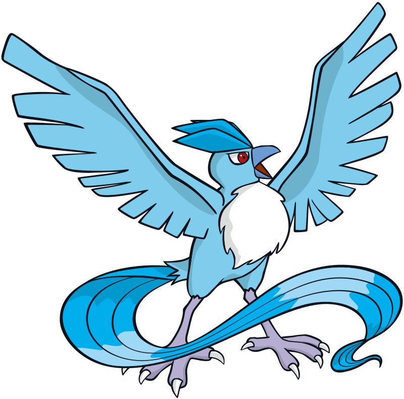
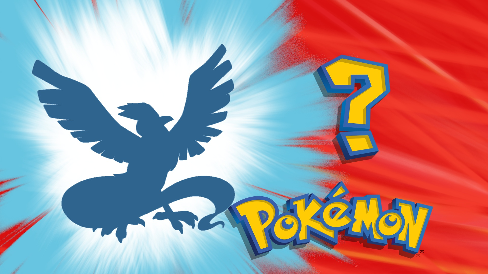

Intro
---
This is a fun project for me to learn about Computer Vision. I'm using openpyCV to generate pokemon's silhouettes.

|Before|After|
|:-:|:-:|
|||

Ideas
---
Apart from the base game, I would like to add different levels of difficulties or hints (this is WIP)
- Making the game harder:
    - Adding rotations/distortions
    - Using newer pokemon generations

- Making the game easier:
    - Showing the primary colors in the silhouettes
    - Showing information (eg. pokemon type)
    - Using older pokemon generations
    - Other ideas, but mostly about image processing

Acknowledgements
---
- Pokemon images are from https://pokemondb.net/
- All the Pokemon names, images and sounds are copyrighted by Nintendo.
