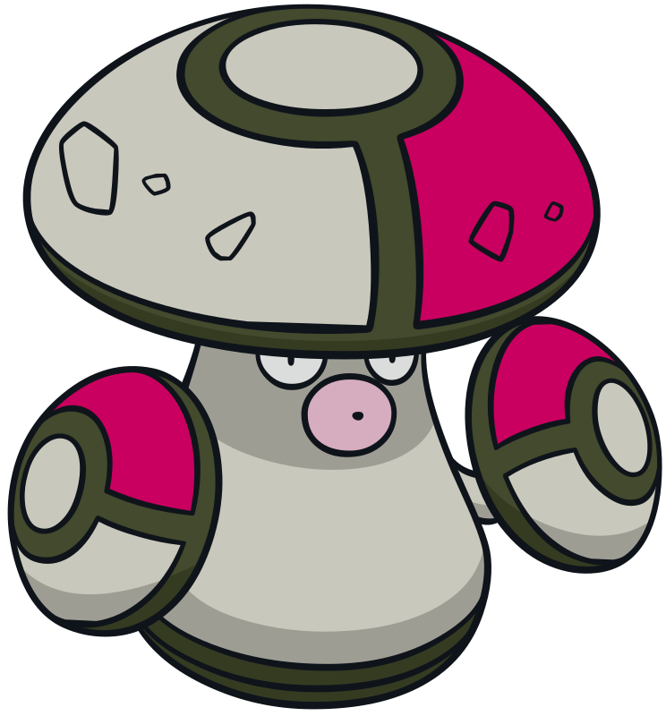
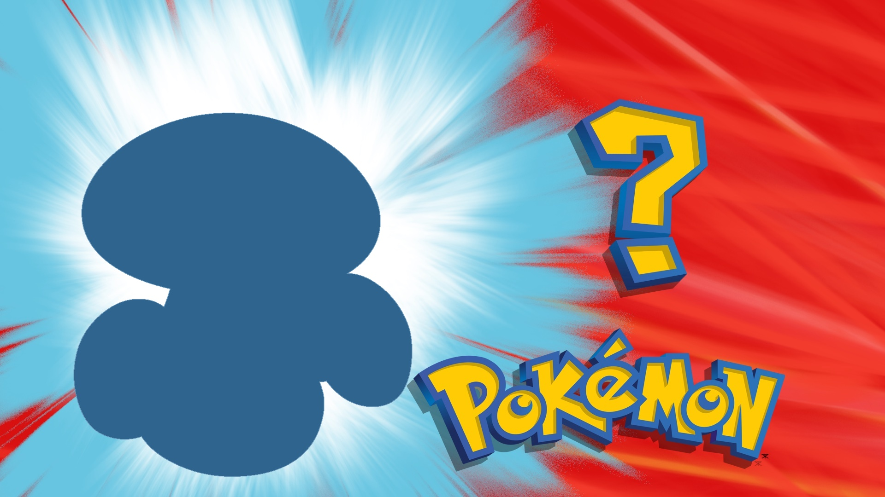
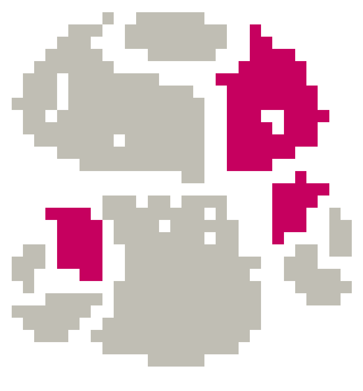

Intro
---
This is a fun project for me to learn about computer vision and image processing. I'm primarily using [opencv](https://opencv.org/) to manipulate pokemon images and generate silhouettes.

|Description|Sample|
|:-:|:-:|
|Original image| <small>Works best if the original image has plain or transparent background</small>|
|Displayed as question| <small>This is created by finding the external contours of the original image and fill in the interior polygon with solid color</small>|
|Hint #1| <small>This is created by pixelating the orignal image, and re-color using k-means clustering</small>|

Ideas
---
Apart from the base game, I would like to add different levels of difficulties or hints (this is WIP)
- Making the game harder:
    - Adding rotations/distortions
    - Using newer pokemon generations

- Making the game easier:
    - Showing the primary colors in the silhouettes
    - Showing more information (eg. pokemon type)
    - Using older pokemon generations
    - Other ideas, but mostly centered around image processing

Acknowledgements
---
- Pokemon images are from https://pokemondb.net/
- All the Pokemon names, images and sounds are copyrighted by Nintendo.
